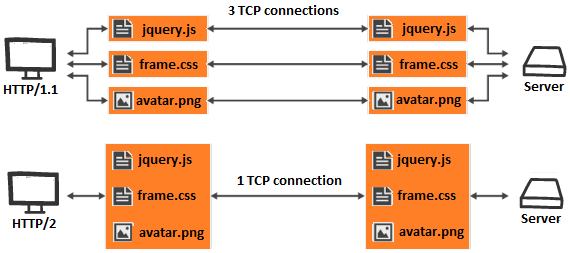

# HTTP/2

HTTP/2는 HTTP/1.1 프로토콜을 실질적이고 측정 가능하게 개선하는 효율적인 프로토콜입니다.

더 큰 그림의 일부로 HTTP/2에는 두 부분이 있습니다.

* 프레이밍 레이어(The framing layer) : HTTP/2 멀티플렉싱 핵심 기능입니다.
* 데이터 영역(The data layer) : 여기에는 데이터 (일반적으로 HTTP라고 함)가 포함됩니다.

다음 다이어그램은 HTTP / 1.1 (위) 및 HTTP / 2 (아래)의 통신을 보여줍니다.

HTTP / 2는 서버와 브라우저에서 널리 채택되고 있으며 HTTP / 1.1에 비해 다음과 같이 개선되었습니다.

* 바이너리 프로토콜(Binary protocol) : 사람이 읽을 수는 없지만 기계 친화적 인 HTTP / 2 프레이밍 레이어는 바이너리 프레임 프로토콜입니다.
* 멀티플렉싱(Multiplexing) : 이것은 서로 짜여진 요청 및 응답을 나타냅니다. 여러 요청이 같은 연결에서 동시에 실행됩니다.
* 서버 푸시(Server push) : 서버는 클라이언트에 추가 리소스를 보내기로 결정할 수 있습니다.
서버에 대한 단일 연결(Single connection to server) : HTTP / 2는 원본 (도메인) 당 단일 통신 회선 (TCP 연결)을 사용합니다.
* 헤더 압축(Header compression) : HTTP / 2는 HPACK 압축에 의존하여 헤더를 줄입니다. 이는 중복 바이트에 상당한 영향을 미칩니다.
* 암호화 됨(Encrypted) : 유선을 통해 전송되는 대부분의 데이터가 암호화됩니다.